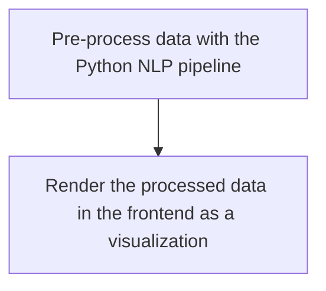

# Elalytics Frontend Website

This web application is built using [Next.js](https://nextjs.org/).

## Prerequisites

- [Node.js](https://nodejs.org/en)
- npm

## Setting up the local development server
- Clone the repository to the local machine
- Open the repository in VS Code
- Initialize the submodules. Refer to the instructions below.
- Run `npm install` in the terminal to install all the required packages
- Run the development server

Setting up the local development server is just a one-time process. After that, you just need to run `npm run dev` in the terminal.

## Initializing the submodules
- This repository includes [elalytics-data-processing](https://github.com/elalytics/elalytics-data-processing) as a submodule. Use the following commands in the terminal to initialize the submodule:
  ```bash
  git submodule update --init --recursive
  git checkout main
  git submodule foreach 'git checkout main'
  ```

## Running the development server

```bash
npm run dev
```

Open [http://localhost:3000](http://localhost:3000) with your browser to see the result.

## Deploying to production

The website is deployed to [Vercel](https://vercel.com/). The deployment is done automatically when changes are pushed to the `main` branch.

## Process



- This repository contains the frontend code for the Elalytics project whereas the data processing is done in the [elalytics-data-processing](https://github.com/elalytics/elalytics-data-processing) python repository.
- The data processed in the python repository is stored in the `app/data-processing` directory which is added as a git submodule. Whenever the data is updated in the NLP pipeline repository, the changes can be pulled in this repository.
- The pre-processed data is stored as a JSON file. We have typically used Chart.js or D3.js to render the visualizations in the frontend.

## File structure

Next.js follows a file-based routing system. For more information, see the [Next.js documentation](https://nextjs.org/docs/app/building-your-application/routing).

- `app/`: Contains the pages of the website.
- The data processed from the NLP pipeline python repository is stored in the `app/data-processing` directory which is added as a git submodule. Whenever the data is updated in the NLP pipeline repository, the changes can be pulled in this repository.
- `app/utils/`: Contains utility functions and predefined charts.
- `app/books/`: Contains the visualization for the books where each folder represents a book. The folder contains multiple visualizations for the book.
- Similarly, `app/plays/` and `app/short-stories/` contain the visualizations for the plays and short stories respectively.

## Wordcloud Generator

- For the Elalytics project, we have built a wordcloud generator that generates wordclouds based on the text input. The wordcloud generator can be accessed here [https://elalytics-chart-generator.streamlit.app/](https://elalytics-chart-generator.streamlit.app/). The generator is built using Python and Streamlit. The code can be found in the `elalytics-data-processing` github repository. The generated wordcloud data is stored in firebase and is accessed by the frontend website. The code for wordclouds visualizer in the frontend can be found in the `app/wordcloud/` folder.
